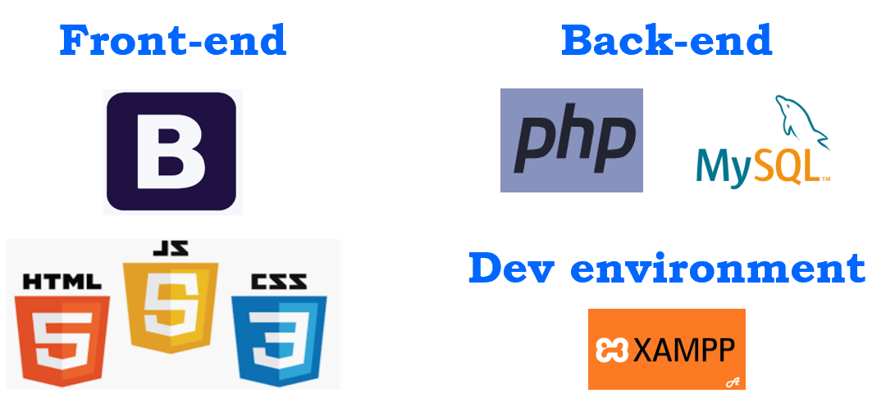

# TFT-app-php
**An app introducing TFT champions built with *PHP* + *HTML* + *CSS(Bootstrap)* + *JQuery*.**

This is my first PHP project. I think it's very suitable for PHP beginners. And I will also upload my PHP study nodes in my blog. You can check it [here](https://tongshi049.github.io/). Hope they will be helpful.

#

## Overview

1. Builds **front-end** using **HTML**, styles it with **Bootstrap** and **CSS**, improves UX using **JQuery** and enables the partially updating the web page by utilizing **Ajax**.
2. Develops **back-end** using **PHP + MySQL**.
3. Develops **authentication** service to distinguish the privileges between admins and users.
4. **OOP** design pattern is utilized throughout the whole design procedure of back-end services. Besides **objects used to interact with the database** like **Champion**, **Category**, **User**, **ojbects used to enable specific functions** like **Authentication**, **Database connection**, **URL Redirection**, **Pagination** are also created.
5. **PHP Data Objects(PDO)** is utilized as the data-access abstraction layer.
6. Deals with the **many-to-many** relationship between two tables by creating an additional table with *ids* in those two tables as its *primary key* and *foreign keys*.
   
#

## Project Snapshot

1. **Project conclustion**:
<div>
  
</div>
<br> 

2. **Index page for normal user**:
<div>
  
</div>
<br> 

3. **Champion introduction page for normal user**:
<div>
  
</div>
<br> 

4. **Login page**:
<div>
  
</div>
<br> 

5. **Index page for admin**:
<div>
  
</div>
<br> 

6. **Champion page for admin**:
<div>
  
</div>
<br> 

7. **Creating and Editting champion pages**:
<div>
  
</div>
<div>
  
</div>
<br>

8. **Editing image files page**:
<div>
  
</div>
<br>


#

## Getting Started

- Clone the project 
```
git clone  https://github.com/tongshi049/TFT-app-php.git
```
- Open XAMPP control panel, then open `Apache(httpd.conf)` file, modify the directory in `DocumentRoot " "` and 
`<Directory " ">` to the current project folder

- Start `Apache` and `MySQL` services, and open `localhost` in your browser

#

## Project Structure

```
|- admin/                       files related to admin operations
|- classes/                     encapsulate ojects
|- css/                         global CSS files
|- js/                          global js files
|- includes/                    utility files 
|- uploads/                     uploaded images
|- vendor/                      PHPMailer
|- config.php                   self-defined global constants
|- ...                          files related to normal users operations
```

#

### Dependencies

- "bootstrap": "4.3.1",
- "jquery": "3.4.1",
- "ajax": "1.19.1",
- "XAMPP: "7.3.9",
- "apache": "2.4.41",
- "MariaDB": "10.4.6",
- "php": "7.3.9"

#

### Libraries

- [PHP](https://www.php.net/).
- [HTML, CSS, JavaScript](https://devdocs.io/html/).
- [Bootstrap](https://getbootstrap.com/).
- [JQuery](https://jquery.com/).
- [Ajax](https://plainjs.com/javascript/ajax/send-ajax-get-and-post-requests-47/).
- [MariaDB](https://mariadb.com/kb/en/library/documentation/).
